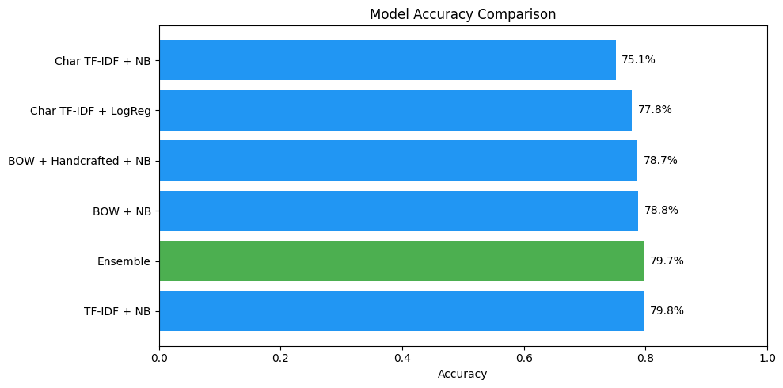
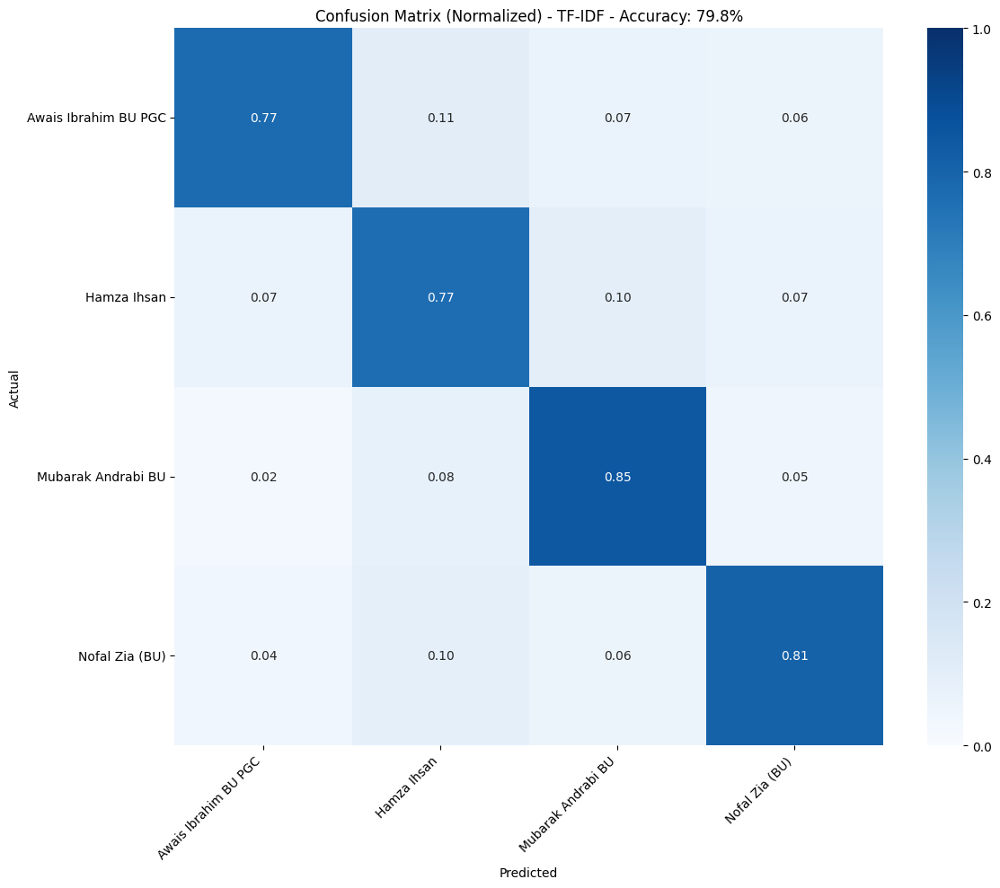
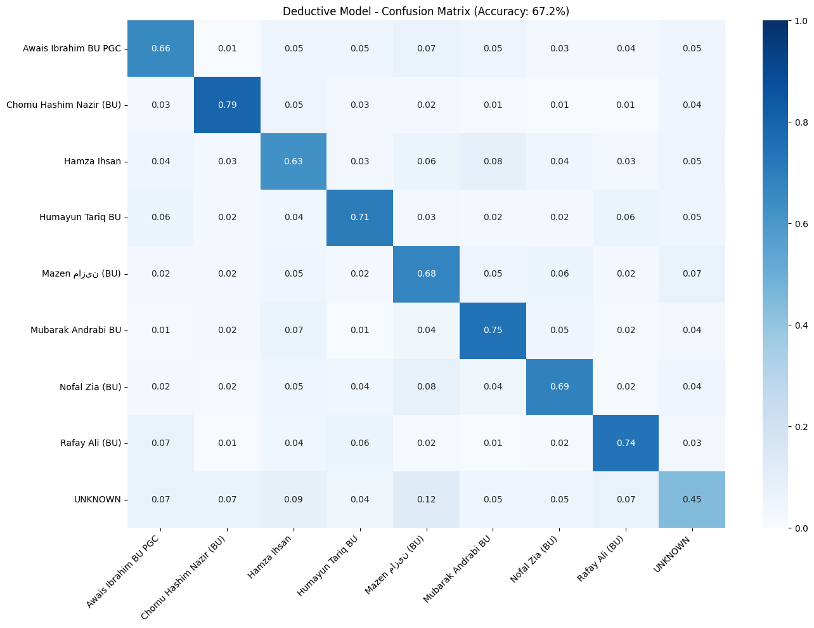
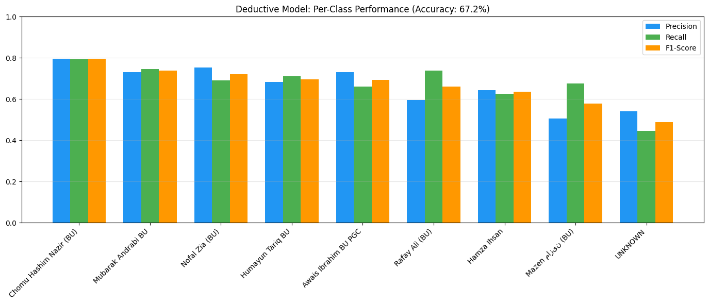

# Deductive Authorship Attribution

WhatsApp chat authorship attribution using machine learning — identifies the most likely author from **8 known senders** or flags the message as **UNKNOWN**.

---

## Project Stats

### Dataset Overview

| Metric | Value |
|--------|-------|
| Total chat participants | 36 |
| Known authors (top 8 by volume) | 8 |
| Balanced dataset size | **19,350 messages** |
| Train / Test split | 80% / 20% |
| Feature types | Word BOW, Word TF-IDF, Char N-Grams + TF-IDF, Handcrafted (12 features) |

### Top 8 Known Authors — Dataset Distribution

| Author | Messages (balanced) |
|--------|-------------------|
| A01 | 3,000 |
| A02 | 3,000 |
| A03 | 3,000 |
| A04 | 3,000 |
| A05 | 2,295 |
| A06 | 2,049 |
| A07 | 1,981 |
| A08 | 1,789 |
| UNKNOWN (sampled) | 2,417 |

---

## 4-Author Model Performance

5 models + ensemble trained on 4 highest-volume authors (12,000 messages balanced).



| Model | Accuracy |
|-------|----------|
| Word TF-IDF + NB | **79.75%** |
| Ensemble (all models) | **79.67%** |
| Word BOW + NB | 78.83% |
| BOW + Handcrafted + NB | 78.67% |
| Char TF-IDF + LogReg | 77.75% |
| Char TF-IDF + NB | 75.08% |

### Per-Sender Metrics (Best Model: TF-IDF + NB)

| Author | Precision | Recall | F1-Score |
|--------|-----------|--------|----------|
| A01 | 0.856 | 0.772 | 0.812 |
| A02 | 0.825 | 0.807 | 0.816 |
| A03 | 0.791 | 0.847 | 0.818 |
| A04 | 0.729 | 0.765 | 0.746 |



---

## Deductive 9-Class Model (8 Known + UNKNOWN)

Single Char TF-IDF + Logistic Regression model trained on all 8 known authors + UNKNOWN class.

**Overall Accuracy: 67.23%**

### Per-Class Breakdown

| Class | Precision | Recall | F1-Score | Support |
|-------|-----------|--------|----------|---------|
| A01 | 0.775 | 0.647 | 0.705 | 600 |
| A02 | 0.753 | 0.690 | 0.720 | 600 |
| A03 | 0.730 | 0.747 | 0.738 | 600 |
| A04 | 0.629 | 0.555 | 0.590 | 600 |
| A05 | 0.797 | 0.793 | 0.795 | 459 |
| A06 | 0.619 | 0.638 | 0.629 | 257 |
| A07 | 0.675 | 0.647 | 0.661 | 397 |
| A08 | 0.671 | 0.681 | 0.676 | 358 |
| UNKNOWN | 0.523 | 0.463 | 0.491 | 483 |





---

## Models

### 13 Models Deployed

| # | Model | Classes |
|---|-------|---------|
| 1 | Word BOW + NB | 8 authors |
| 2 | Word TF-IDF + NB | 8 authors |
| 3 | Char N-Grams + TF-IDF + NB | 8 authors |
| 4 | Char N-Grams + TF-IDF + LogReg | 8 authors |
| 5 | BOW + Handcrafted + NB | 8 authors |
| 6 | Ensemble | 8 authors |
| 7–12 | Same 6 models | 4 authors |
| 13 | **Deductive Char TF-IDF + LogReg** | **9-class** |

### Feature Sets

| Feature Type | Details |
|-------------|---------|
| Word BOW | CountVectorizer, word (1,2)-grams, max 10,000 |
| Word TF-IDF | TfidfVectorizer, word (1,2)-grams, max 10,000 |
| Char N-Grams + TF-IDF | TfidfVectorizer, char (3,5)-grams, max 10,000 |
| Handcrafted | char_count, word_count, avg_word_length, uppercase_ratio, punctuation_count, digit_count, emoji_count, has_emoji, question_mark_count, exclamation_count, url_count, language_mix_ratio |

---


## Dashboard

Interactive Streamlit app with two tabs:
- **Author Predictor** — paste a message, select a model, get prediction with confidence & probability bar chart
- **Model Benchmarks** — compare all 13 models, view per-sender metrics, interactive Plotly charts

**Run locally:**
```bash
streamlit run app.py
```

---

## Stack

- **Python** — Pandas, NumPy, Scikit-learn, Matplotlib, Seaborn
- **Web** — Streamlit, Plotly
- **Model format** — Pickle (.pkl)
